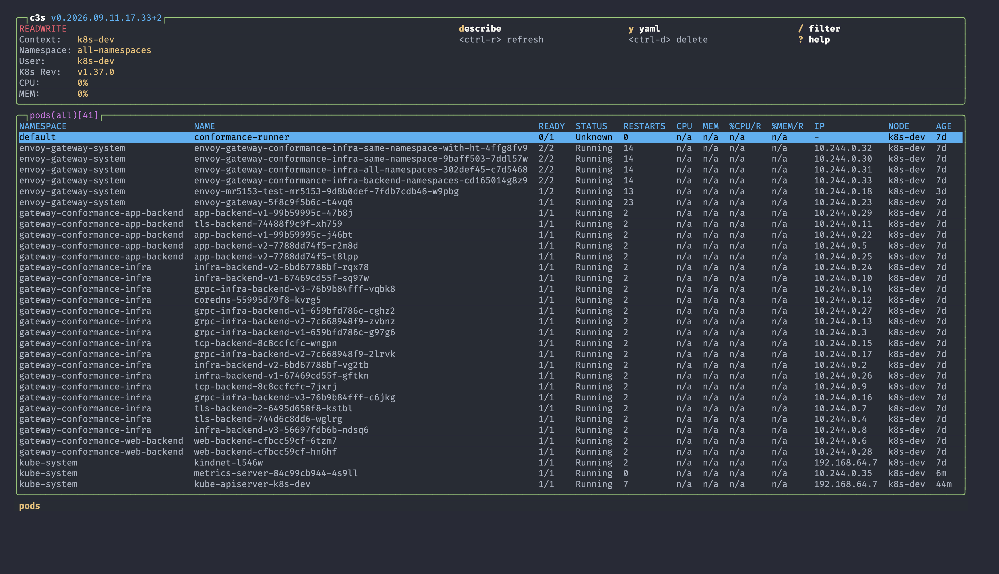
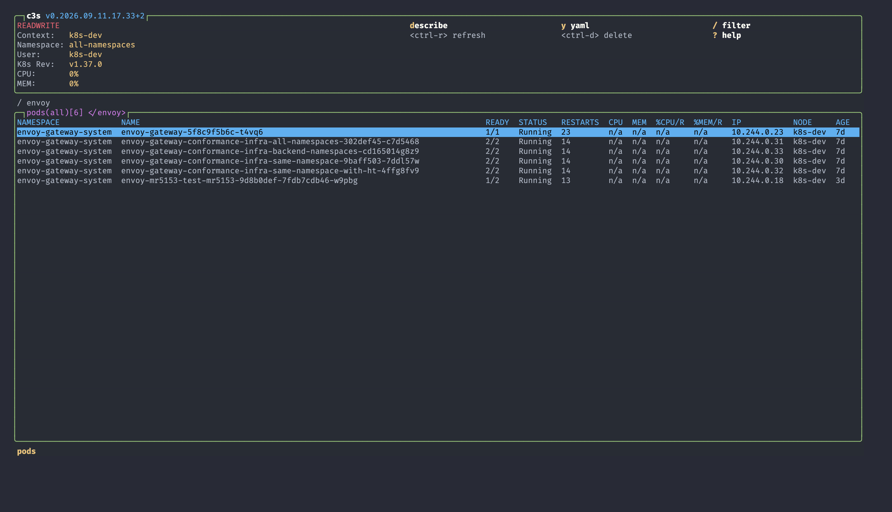
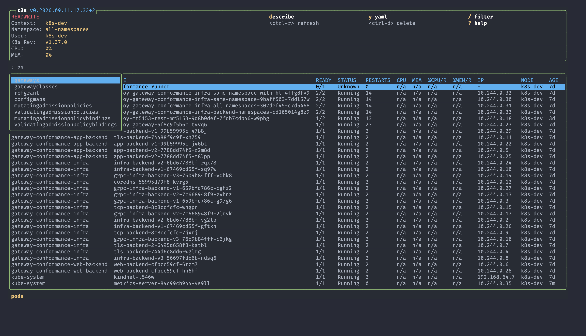
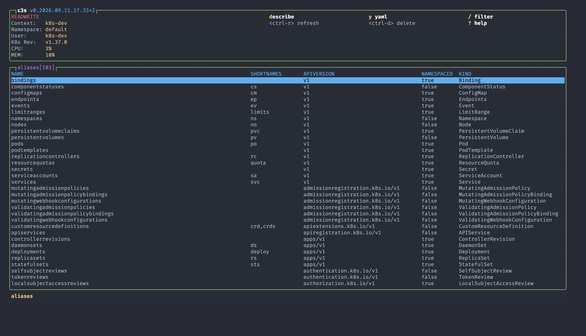
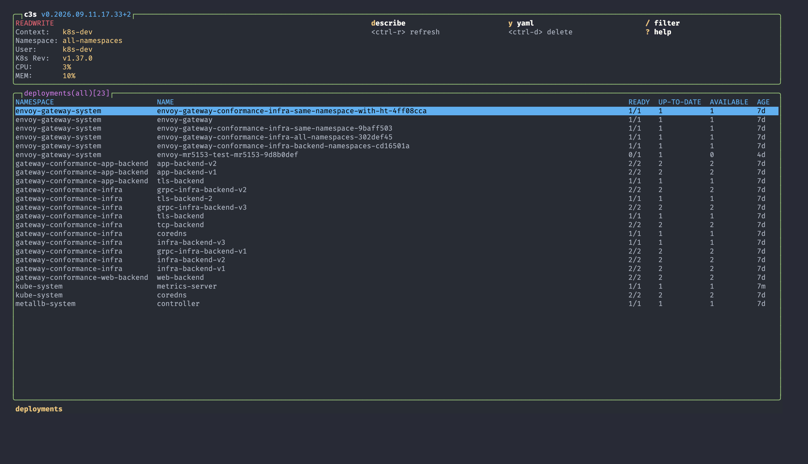
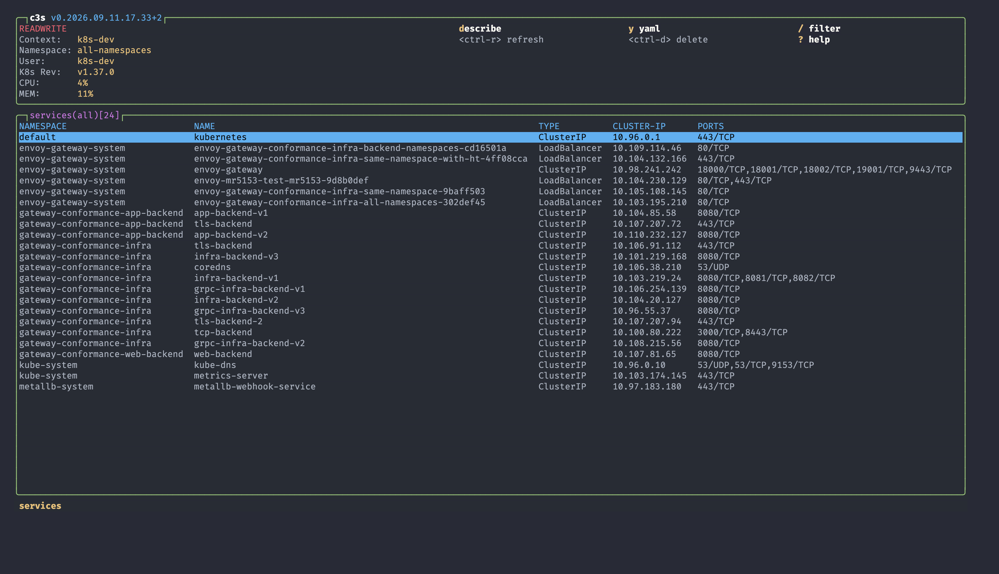

# c3s - Kubernetes TUI in Zig

> A blazing-fast Kubernetes Terminal User Interface (TUI) written in Zig, inspired by k9s and btop.

[](https://github.com/guanchzhou/c3s/actions/workflows/ci.yml)
[]()
[]()

---

## 🚀 **Features**

### **One Generic Table Engine**
Every resource view — pods, deployments, services, daemonsets, PDBs, and the rest — is rendered by a single comptime `ResourceView` engine (`src/view/resource_view.zig`). Adding a resource is a declarative config in `src/view/resource_configs.zig`, not a bespoke renderer. Rendering, sorting, marking, filtering, and namespace scoping behave identically everywhere.

### **Tables That Feel Right**
- ✅ **Full-width layout:** tables fill the terminal; the NAME column stretches to absorb slack.
- ✅ **Full namespace names** and a full-width selection highlight bar.
- ✅ **UTF-8-safe truncation:** long values are clipped on glyph boundaries — no broken multi-byte characters.
- ✅ **Per-column sorting:** `Shift-<letter>` toggles the sort key with a ▲/▼ indicator (e.g. pods: `Shift-N` name, `Shift-R` ready, `Shift-S` status, `Shift-C` cpu, `Shift-M` mem, `Shift-I` ip, `Shift-A` age).
- ✅ **Row marking:** `Space` toggles a k9s-style mark on the current row; marks persist by row identity across cursor moves and refreshes.
- ✅ **Live filtering:** `/` filters the table; the title shows a `</term>` indicator. Clear with `x` or `Esc`. Prefixes: `!term` inverse, `-f term` fuzzy, `-l k=v` label selector. `Ctrl-Z` toggles faults-only.
- ✅ **Namespace scoping:** `0` toggles all-namespaces. The box title reflects scope and count k9s-style — `pods(default)[8]` or `pods(all)[104]` — and the redundant NAMESPACE column is hidden when scoped to a single namespace.

### **Fuzzy Command Palette**
Press `:` or `Ctrl-P` to open a live, fuzzy-ranked command dropdown (bordered popup). Type to filter, `Tab`/`↑`/`↓` to navigate, `Enter` to run. Every resource view and `:aliases` is a command.

### **Aliases View**
`Ctrl-A` (or `:aliases`) opens a real table of API resources — NAME / SHORTNAMES / APIVERSION / NAMESPACED / KIND — with working filter. `Ctrl-A` again toggles it off.

### **Embedded Istio Traffic View**
Press `t` on a deployment to open a live traffic topology:
- Inbound/outbound graph plus a per-peer table (req/s, success %, p50/p99 latency).
- Sourced from Istio's Prometheus metrics via the API-server service proxy.
- Fetched on a **background thread** — the UI never blocks — with ~5s auto-refresh.
- `q`/`Esc` back, `r` refresh, `j`/`k` scroll.

Powered by the `kubectl_traffic` sibling package.

### **50+ Kubernetes Resource Views**
- ✅ **Workloads:** Pods, Deployments, StatefulSets, DaemonSets, ReplicaSets, Jobs, CronJobs
- ✅ **Config & Storage:** ConfigMaps, Secrets, PersistentVolumes, PersistentVolumeClaims, StorageClasses, VolumeAttributesClasses, CSIDrivers
- ✅ **Networking:** Services, Endpoints, EndpointSlices, Ingresses, IngressClasses, NetworkPolicies, IPAddresses, ServiceCIDRs
- ✅ **Gateway API:** GatewayClasses, Gateways, HTTPRoutes, GRPCRoutes, TCP/TLS/UDPRoutes, ReferenceGrants, BackendTLSPolicies, ListenerSets
- ✅ **RBAC:** ServiceAccounts, Roles, RoleBindings, ClusterRoles, ClusterRoleBindings
- ✅ **Admission:** Validating/Mutating AdmissionPolicies and Bindings, Validating/Mutating WebhookConfigurations
- ✅ **Cluster:** Namespaces, Nodes, Events, ResourceQuotas, LimitRanges, PodDisruptionBudgets, PriorityClasses, RuntimeClasses, Leases, CSRs, StorageVersionMigrations
- ✅ **Autoscaling / DRA:** HorizontalPodAutoscalers, ResourceClaims, DeviceClasses

### **Pod Actions**
Describe (`d`), YAML (`y`), logs (`l`), edit (`e` — any resource), shell (`s`), attach (`a`), port-forward (`Shift-F` on pods and services), delete (`Ctrl-D`).

### **Context & Themes**
- Context management: list kubeconfig contexts, interactive switching, multi-cluster support.
- 35+ built-in themes plus k9s-compatible custom skins.

### **Supervised data plane**
Resource views subscribe to a shared LIST + WATCH plane instead of polling. Incremental projections keep rows and selection during relists; pod CPU/MEM come from projected metrics. Direct HTTPS is used for readonly reads, with a bounded proxy fallback.

### **Performance**
- ⚡ **Fast:** native Zig, no runtime/GC.
- 🪶 **Lightweight:** low memory footprint.
- 🎯 **Non-blocking:** LIST/WATCH, metrics, and traffic fetch run off the UI thread.

---

## 📊 **Measured against k9s**

Medians over five fresh processes each, read-only, all namespaces, on a cluster
of 277 nodes, 124 namespaces, 4,792 pods and 1,078 deployments where
`kubectl get pods -A` takes 5.7 s. Measured 2026-09-10 on an Apple M5
(10 cores, 32 GB, macOS 27) in a 120×40 PTY, c3s built ReleaseFast at
`v0.2.0+2` against Homebrew k9s 0.51.0.

| | c3s | k9s |
|---|---|---|
| Pod rows visible in the terminal | 2.38 s | 41.5 s |
| RSS 2 s after first rows | 33.9 MB *(83.7 MB with helpers)* | 1,167 MB |
| RSS at 25 s | 85.9 MB *(135.3 MB with helpers)* | 620 MB |
| Threads at 25 s | 7 | 22 |
| Binary on disk | 8.4 MB | 142.8 MB |
| `--version` | 2.5 ms | 32.6 ms |

The first row uses the same instrument for both programs: the terminal is read
until pod rows appear. c3s also emits its own timing markers, which put the
LIST-to-first-rows cost at 0.38 s and process-start-to-first-rows at 2.77 s.

c3s shells out to `kubectl` and to a credential helper, so the parenthesised
figure — the whole process tree — is the one to compare against k9s, which runs
as a single process. RSS is `ps` RSS in KB / 1000.

Reproduce with:

```bash
zig build -Doptimize=ReleaseFast
python3 tools/perf/compare.py --context <ctx> --all-namespaces --runs 5 --sample-s 25
```

### What this does not show

- **Startup is not symmetric.** k9s is launched with `-A -c po` and opens on
  all namespaces. c3s starts in the default namespace and is switched with `0`,
  so its terminal-observed figure includes that switch.
- **"All rows loaded" is unmeasured.** k9s exposes no such signal, and on a
  cluster this size the c3s all-namespaces pod subscription does not currently
  emit its completion marker. Neither number is reported, and the table above
  says nothing about when a full sync finishes.
- **One machine, one cluster, read-only.** k9s timing includes its Homebrew
  launcher. The two programs render different columns and refresh on different
  schedules. Bytes written to the terminal are recorded by the harness but are
  not a c3s win.

---

## 📦 **Installation**

### **Homebrew**

```bash
brew install guanchzhou/tap/c3s
```

Installs the current GitHub Release binary (linux/macOS, amd64/arm64).

### **Prerequisites**
- Zig 0.16.0 (release baseline) or current Zig 0.17-dev
- kubectl configured with a valid kubeconfig
- Kubernetes cluster access (optional: use `--debug` for demo data)

### **Build from Source**

```bash
git clone https://github.com/guanchzhou/c3s.git
cd c3s
zig build
```

> c3s depends on two sibling packages via relative paths in `build.zig.zon`:
> `../zig-klient` (the Kubernetes client) and `../kubectl-traffic` (the traffic
> view). Check them out next to the c3s directory before building.

### **Run**

```bash
# Connect to current kubectl context
./zig-out/bin/c3s

# Use a specific context
./zig-out/bin/c3s --context my-cluster

# Debug mode (no cluster required)
./zig-out/bin/c3s --debug
```

---

## 🎯 **Quick Start**

### **Navigation & Global Keys**

| Key | Action |
|-----|--------|
| `j` / `k` or `↑` / `↓` | Move cursor |
| `g` / `Shift-G` | Top / bottom |
| `Space` | Mark / unmark current row |
| `Shift-<letter>` | Sort by that column (▲/▼) |
| `/` | Filter (`!` inverse, `-f` fuzzy, `-l` labels) |
| `Ctrl-Z` | Toggle faults-only |
| `x` | Clear filter |
| `0` | Toggle all namespaces |
| `r` | Refresh |
| `:` or `Ctrl-P` | Fuzzy command palette |
| `Ctrl-A` | Aliases (API resources) view |
| `?` | Help |
| `Esc` | Clear filter / back |
| `q` | Quit (or `:q`) |

### **Pod Actions** (on a selected pod)

| Key | Action |
|-----|--------|
| `d` | Describe |
| `y` | View YAML |
| `l` | Logs |
| `e` | Edit (`kubectl edit`; any resource) |
| `s` | Shell into container |
| `a` | Attach |
| `Shift-F` | Port-forward (pods and services) |
| `Ctrl-D` | Delete |

### **Deployment Actions**

| Key | Action |
|-----|--------|
| `t` | Open live Istio traffic view |

### **Essential Commands**

```
:pods               # View pods
:deployments        # View deployments
:services           # View services
:gateways           # Gateway API
:httproutes         # HTTPRoutes (`:htr`)
:aliases            # API-resources table
:contexts           # Manage contexts
:events             # View cluster events
:hpa                # View HorizontalPodAutoscalers
```

---

## 🎨 **Screenshots**

Captured from a live v1.37.0 cluster.

### Pods, all namespaces



### Live filter

Press `/` and type; the row count and the active filter show in the title.



### Fuzzy command palette

Press `:` and type a fragment — `ga` ranks `gatewayclasses`, `refgrant`, and the admission-policy views.



### Aliases

Every API resource discovered from the cluster, with short names and kinds.



### Deployments and services





---

## 🏗️ **Architecture**

c3s follows **MVVM (Model-View-ViewModel)**. Resource tables subscribe to a supervised data plane; the UI thread alone mutates table and selection state.

```
┌─────────────────────────────────────────────────┐
│                   View Layer                     │
│  Generic ResourceView engine + dedicated views   │
│  (traffic, aliases, contexts, themes, help, …)   │
└────────────────┬────────────────────────────────┘
                 │
┌────────────────▼────────────────────────────────┐
│                ViewModel Layer                   │
│  ViewManager, CommandRegistry, fuzzy palette     │
└────────────────┬────────────────────────────────┘
                 │
┌────────────────▼────────────────────────────────┐
│                Service Layer                     │
│  K8sService — kubectl mutations, readonly fence  │
└────────────────┬────────────────────────────────┘
                 │
┌────────────────▼────────────────────────────────┐
│                Data plane                        │
│  LIST + WATCH subscriptions, ChangeQueue,        │
│  lifecycle supervisor, direct HTTPS / proxy      │
└────────────────┬────────────────────────────────┘
                 │
┌────────────────▼────────────────────────────────┐
│                Data Layer                        │
│  zig-klient (K8s API) + kubectl_traffic (Istio)  │
└──────────────────────────────────────────────────┘
```

**Key Components:**
- **ResourceView:** one comptime engine drives every resource table (config in `resource_configs.zig`).
- **ViewManager:** stack-based view navigation.
- **CommandRegistry:** k9s-compatible commands, surfaced through the fuzzy palette.
- **Data plane:** per-context LIST then WATCH; bounded change batches delivered to the UI thread.
- **K8sService:** kubectl mutations pinned to kubeconfig/context and fenced by `--readonly`.
- **TrafficView:** background-threaded Istio metrics topology.
- **Theme System:** k9s-compatible theming (35+ themes).

---

## 🧪 **Testing**

```bash
# Build
zig build

# Unit tests + integration suites
zig build test-all

# k9s command/key contract (through App.handleKey / :aliases, not isolated views)
zig build test-k9s-parity
```

Unit tests cover the table engine, resource views, data plane, service layer, and
memory-leak detection. Linux CI runs `zig build test-all`; macOS CI runs on `main` only.

---

## 🤝 **Contributing**

Contributions welcome:

1. Fork the repository
2. Create a feature branch
3. Follow the existing patterns (MVVM; add resources declaratively in `resource_configs.zig`)
4. Add tests for new features
5. Run `zig fmt --check src/ tests/ build.zig build.zig.zon`
6. Submit a pull request

---

## 🗺️ **Roadmap**

### ✅ **Completed**
- [x] 50+ Kubernetes resource views
- [x] Unified generic table engine (pods migrated off its bespoke renderer)
- [x] Supervised LIST + WATCH data plane for resource views
- [x] Full-width layout, glyph-safe UTF-8 truncation, full-width selection bar
- [x] Per-column sorting (`Shift-<letter>` with ▲/▼)
- [x] Row marking (`Space`)
- [x] Live filtering (`/`, inverse / fuzzy / labels, `Ctrl-Z` faults-only)
- [x] Namespace scoping (`0`) with k9s-style scoped titles
- [x] Fuzzy command palette (`:` / `Ctrl-P`)
- [x] Aliases / API-resources view (`Ctrl-A`)
- [x] Embedded Istio traffic view (`t` on a deployment, background-threaded)
- [x] Pod actions: describe / YAML / logs / edit / shell / attach / port-forward / delete
- [x] Context management
- [x] Theme system (35+)
- [x] GitHub Actions CI (`zig build test-all` on Linux; macOS on `main`)

### 📅 **Planned**
- [ ] Custom resource (CRD) support
- [ ] Plugin system
- [ ] Resource creation wizards
- [ ] Diff/compare views
- [ ] Multi-cluster dashboard
- [ ] Metrics integration beyond pod CPU/MEM

---

## ⚙️ **Configuration**

### **Config File**
Located at: `~/.config/c3s/config.yml`

```yaml
ui:
  theme: dracula    # Theme name
  compact: false    # Compact mode
  footer: true      # Show footer
```

### **Themes**
Place custom k9s skins in: `~/.config/c3s/skins/`

### **Logs**
View logs at: `~/.local/state/c3s/c3s.log`

---

## 🐛 **Troubleshooting**

### Connection Issues
```bash
# Check kubectl context
kubectl config current-context

# Run in debug mode (no cluster required)
./zig-out/bin/c3s --debug
```

### Context Not Found
```bash
# List available contexts
kubectl config get-contexts

# Use a specific context
./zig-out/bin/c3s --context <name>
```

---

## 🏆 **Why c3s?**

### vs kubectl
- ✅ **Visual:** TUI vs command-line
- ✅ **Efficient:** navigate with the keyboard
- ✅ **Intuitive:** see all resources at once

### vs k9s
- ✅ **Performance:** native Zig, no GC — see [Measured against k9s](#-measured-against-k9s)
- ✅ **Memory:** 84 MB of process tree against 1,174 MB on a 4,792-pod cluster
- ✅ **Compatible:** familiar commands and themes
- ✅ **Traffic:** built-in Istio topology view

### vs Lens
- ✅ **Lightweight:** TUI vs Electron
- ✅ **Fast:** instant startup
- ✅ **Terminal:** works over SSH

---

## 📜 **License**

Apache License 2.0 — see [LICENSE](LICENSE).

---

## 🙏 **Acknowledgments**

- **[k9s](https://k9scli.io/)** — inspiration for UX and commands
- **[btop](https://github.com/aristocratos/btop)** — UI design inspiration
- **[sofka](https://sofka.rs/)** — inspiration for typed filters and read-only guardrails
- **[zig-klient](https://github.com/guanchzhou/zig-klient)** — Kubernetes client library
- **Zig Community** — amazing language and ecosystem

---

**Built with ❤️ in Zig — fast, lightweight, powerful.**
